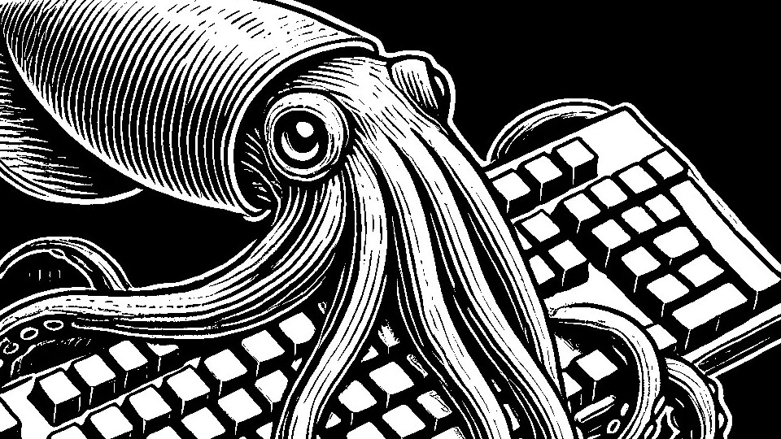

# CCT

Since 2024.10.26

## Language

## Summary

|                  Category                   | Solved | Last |
| :-----------------------------------------: | :----: | :--: |
|           [BFS / DFS](#bfs--dfs)            |        |      |
|      [Implementation](#implementation)      |        |      |
| [Dynamic Programming](#dynamic-programming) |        |      |
|              [Greedy](#greedy)              |        |      |
|         [Brute Force](#brute-force)         |        |      |
|         [Two-Pointer](#two-pointer)         |        |      |
|               [Stack](#Stack)               |        |      |
|            [Sweeping](#sweeping)            |        |      |
|          [Simulation](#simulation)          |        |      |
|                [Tree](#tree)                |        |      |
|            [Dijkstra](#dijkstra)            |        |      |
|      [Floyd-Warshall](#floyd-warshall)      |        |      |

## Symbols

- solved : Defined as solving a problem by calculating time complexity and space complexity, planning the solution beforehand, and then implementing it.
- ☑️ : Solved within an hour, no need to revisit.
- ✅ : Solved in over an hour, but worth revisiting..
- ❌ : Could not solve within 1 hour. Needed to refer to others' solutions or study more. Should be revisited.

## Practice

### Datastructure 1

|                         Name                          | Level | Stack |    Last    |    Next    |
| :---------------------------------------------------: | :---: | :---: | :--------: | :--------: |
|     [스택](https://www.acmicpc.net/problem/10828)     |  S4   |  ☑️   | 2025-02-07 |            |
|  [단어 뒤집기](https://www.acmicpc.net/problem/9093)  |  B1   |  ☑️   | 2025-02-07 |            |
|     [괄호](https://www.acmicpc.net/problem/9012)      |  S4   |  ☑️   | 2025-02-07 |            |
|    [에디터](https://www.acmicpc.net/problem/1406)     |  S2   | ✅✅  | 2025-03-02 | 2025-03-09 |
|      [큐](https://www.acmicpc.net/problem/10845)      |  S4   |  ☑️   | 2025-02-07 |            |
| [요세푸스 문제](https://www.acmicpc.net/problem/1158) |  S4   |  ☑️   | 2025-02-07 |            |
|      [덱](https://www.acmicpc.net/problem/10866)      |  S4   |  ☑️   | 2025-02-07 |            |

### Datastructure 2

|                         Name                          | Level | Stack |    Last    | Next |
| :---------------------------------------------------: | :---: | :---: | :--------: | :--: |
| [단어 뒤집기2](https://www.acmicpc.net/problem/17413) |  S3   |  ☑️   | 2025-02-17 |      |
|   [쇠막대기](https://www.acmicpc.net/problem/10799)   |  S2   |  ❌   | 2025-02-18 |      |
|    [오큰수](https://www.acmicpc.net/problem/17298)    |  G4   |  ☑️   | 2025-02-18 |      |
|   [오등큰수](https://www.acmicpc.net/problem/17299)   |  G3   |  ☑️   | 2025-02-23 |      |

### Datastructure 3

|                         Name                         | Level | Stack | Last | Next |
| :--------------------------------------------------: | :---: | :---: | :--: | :--: |
| [후위 표기식2](https://www.acmicpc.net/problem/1935) |  S3   |       |      |      |
| [후위 표기식](https://www.acmicpc.net/problem/1918)  |  G2   |       |      |      |
| [접미사 배열](https://www.acmicpc.net/problem/11656) |  S4   |       |      |      |

### Mathematics 1

|                           Name                           | Level | Stack | Last | Next |
| :------------------------------------------------------: | :---: | :---: | :--: | :--: |
| [골드바흐의 추측](https://www.acmicpc.net/problem/6588)  |  S1   |       |      |      |
|   [숨바꼭질 6](https://www.acmicpc.net/problem/17087)    |  S2   |       |      |      |
|      [-2진수](https://www.acmicpc.net/problem/2089)      |  S2   |       |      |      |
| [골드바흐 파티션](https://www.acmicpc.net/problem/17103) |  S2   |       |      |      |

## History

### BFS / DFS

  
Programmers

  
BJ

|                           Name                            | Level | Stack |    Last    |    Next    |
| :-------------------------------------------------------: | :---: | :---: | :--------: | :--------: |
|    [유기농 배추](https://www.acmicpc.net/problem/1012)    |  S2   |  ☑️   | 2025-02-15 |            |
| [연결 요소의 개수](https://www.acmicpc.net/problem/11724) |  S2   |  ☑️   | 2025-02-15 |            |
|     [안전 영역](https://www.acmicpc.net/problem/2468)     |  S1   |  ☑️   | 2025-02-15 |            |
|     [미로 탐색](https://www.acmicpc.net/problem/2178)     |  S1   |  ☑️   | 2025-02-15 |            |
|  [단지번호붙이기](https://www.acmicpc.net/problem/2667)   |  S1   |  ☑️   | 2025-02-15 |            |
|     [숨바꼭질](https://www.acmicpc.net/problem/1697)      |  S1   |  ✅   | 2025-02-15 | 2025-02-18 |
|     [적록색약](https://www.acmicpc.net/problem/10026)     |  G5   |  ☑️   | 2025-02-15 |            |
|      [토마토](https://www.acmicpc.net/problem/7576)       |  G5   |  ☑️   | 2025-02-15 |            |
| [트리의 부모 찾기](https://www.acmicpc.net/problem/11725) |  S2   |  ☑️   | 2025-02-15 |            |
|      [알파벳](https://www.acmicpc.net/problem/1987)       |  G4   |  ☑️   | 2025-02-16 |            |
|   [나이트의 이동](https://www.acmicpc.net/problem/7562)   |  S1   |  ☑️   | 2025-02-16 |            |
|    [영역 구하기](https://www.acmicpc.net/problem/2583)    |  S1   |  ☑️   | 2025-02-16 |            |
|     [섬의 개수](https://www.acmicpc.net/problem/4963)     |  S2   |  ☑️   | 2025-02-17 |            |
|      [A → B](https://www.acmicpc.net/problem/16953)       |  S2   |  ☑️   | 2025-02-17 |            |
|    [이분 그래프](https://www.acmicpc.net/problem/1707)    |  G4   |  ❌   | 2025-02-18 | 2025-02-21 |
|      [연구소](https://www.acmicpc.net/problem/14502)      |  G4   |  ❌   | 2025-02-18 | 2025-02-21 |
|      [토마토](https://www.acmicpc.net/problem/7569)       |  G5   |  ☑️   | 2025-02-19 |            |
|     [촌수계산](https://www.acmicpc.net/problem/2644)      |  S2   |  ✅   | 2025-02-19 | 2025-02-22 |
|       [빙산](https://www.acmicpc.net/problem/2573)        |  G4   |  ☑️   | 2025-02-19 |            |
|    [트리의 지름](https://www.acmicpc.net/problem/1967)    |  G4   |  ❌   | 2025-02-19 | 2025-02-22 |
|     [알고스팟](https://www.acmicpc.net/problem/1261)      |  G4   |  ✅   | 2025-02-22 | 2025-02-25 |
|    [트리의 지름](https://www.acmicpc.net/problem/1167)    |  G2   |  ☑️   | 2025-02-22 |            |
|      [ABCDE](https://www.acmicpc.net/problem/13023)       |  G5   |  ❌   | 2025-02-24 | 2025-02-27 |
|    [인구 이동](https://www.acmicpc.net/problem/16234)     |  G4   |  ❌   | 2025-02-24 | 2025-02-27 |
|      [결혼식](https://www.acmicpc.net/problem/16234)      |  S2   |  ☑️   | 2025-03-24 |            |
|    [숫자고르기](https://www.acmicpc.net/problem/2668)     |  G5   |  ❌   | 2025-04-12 | 2025-04-17 |

### Implementation

  
Programmers

  
BJ

### Greedy

  
Programmers

  
BJ

|                                 Name                                 | Level | Stack |    Last    |    Next    |
| :------------------------------------------------------------------: | :---: | :---: | :--------: | :--------: |
|        [카드 정렬하기](https://www.acmicpc.net/problem/1715)         |  G4   |  ☑️   | 2025-03-14 |            |
|           [주유소](https://www.acmicpc.net/problem/13305)            |  S3   |  ☑️   | 2025-03-14 |            |
|          [단어 수학](https://www.acmicpc.net/problem/1339)           |  G4   |  ✅   | 2025-03-15 | 2025-03-20 |
|             [센서](https://www.acmicpc.net/problem/2212)             |  G4   | ❌✅  | 2025-03-21 | 2025-04-04 |
|            [컵라면](https://www.acmicpc.net/problem/1781)            |  G2   | ☑️✅  | 2025-04-17 | 2025-04-22 |
|            [공항](https://www.acmicpc.net/problem/10775)             |  G2   |  ☑️   | 2025-03-17 |            |
|       [멀티탭 스케줄링](https://www.acmicpc.net/problem/1700)        |  G1   |  ☑️   | 2025-03-17 |            |
|         [강의실 배정](https://www.acmicpc.net/problem/11000)         |  G5   |  ❌   | 2025-03-17 | 2025-03-22 |
|           [수 묶기](https://www.acmicpc.net/problem/1744)            |  G4   |  ✅   | 2025-03-17 | 2025-03-22 |
|         [수리공 항승](https://www.acmicpc.net/problem/1449)          |  S3   |  ☑️   | 2025-03-18 |            |
|             [행렬](https://www.acmicpc.net/problem/1080)             |  S1   |  ❌   | 2025-03-18 | 2025-03-23 |
|            [과제](https://www.acmicpc.net/problem/13904)             |  G3   |  ✅   | 2025-03-22 | 2025-03-27 |
|             [트리](https://www.acmicpc.net/problem/1068)             |  G5   |  ✅   | 2025-03-23 | 2025-03-28 |
|       [통나무 건너뛰기](https://www.acmicpc.net/problem/11497)       |  S1   |  ☑️   | 2025-03-24 |            |
|        [흙길 보수하기](https://www.acmicpc.net/problem/1911)         |  G5   |  ☑️   | 2025-03-25 |            |
|        [파일 합치기 3](https://www.acmicpc.net/problem/13975)        |  G4   |  ☑️   | 2025-03-26 |            |
|      [최소 회의실 개수](https://www.acmicpc.net/problem/19598)       |  G5   |  ✅   | 2025-03-27 | 2025-04-01 |
|         [크게 만들기](https://www.acmicpc.net/problem/2812)          |  G3   |  ✅   | 2025-03-30 | 2025-04-04 |
|          [시간 관리](https://www.acmicpc.net/problem/1263)           |  G5   |  ✅   | 2025-03-31 | 2025-04-05 |
| [사전 순 최대 공통 부분 수열](https://www.acmicpc.net/problem/30805) |  G4   |  ❌   | 2025-03-31 | 2025-04-05 |
|           [순회강연](https://www.acmicpc.net/problem/2109)           |  G3   |  ☑️   | 2025-04-01 |            |
|         [겹치는 선분](https://www.acmicpc.net/problem/1689)          |  G4   |  ✅   | 2025-04-01 | 2025-04-06 |
|            [달력](https://www.acmicpc.net/problem/20207)             |  G5   |  ☑️   | 2025-04-02 |            |
|         [행복 유치원](https://www.acmicpc.net/problem/13164)         |  G5   |  ✅   | 2025-04-03 | 2025-04-08 |
|        [전구와 스위치](https://www.acmicpc.net/problem/2138)         |  G4   |  ❌   | 2025-04-04 | 2025-04-09 |
|        [공주님의 정원](https://www.acmicpc.net/problem/2457)         |  G3   |  ✅   | 2025-04-05 | 2025-04-10 |
|         [내일 할거야](https://www.acmicpc.net/problem/7983)          |  G5   |  ✅   | 2025-04-07 | 2025-04-12 |
|             [소트](https://www.acmicpc.net/problem/1083)             |  G4   |  ☑️   | 2025-04-08 |            |
|             [소트](https://www.acmicpc.net/problem/1071)             |  P5   |  ☑️   | 2025-04-09 |            |
|              [배](https://www.acmicpc.net/problem/1092)              |  G5   |  ❌   | 2025-04-14 | 2025-04-19 |

### Brute Force

  
Programmers

  
BJ

### Two-Pointer

  
Programmers

  
BJ

### Stack

  
Programmers

  
BJ

### Sweeping

  
Programmers

  
BJ

### Simulation

  
Programmers

  
BJ

### Sliding Window

  
Programmers

  
BJ

### Binary Search

  
Programmers

  
BJ

|                                 Name                                  | Level | Stack |    Last    |    Next    |
| :-------------------------------------------------------------------: | :---: | :---: | :--------: | :--------: |
|          [나무 자르기](https://www.acmicpc.net/problem/2805)          |  S2   |  ☑️   | 2025-02-25 |            |
|          [랜선 자르기](https://www.acmicpc.net/problem/1654)          |  S2   |  ✅   | 2025-02-25 | 2025-02-28 |
|             [게임](https://www.acmicpc.net/problem/1654)              |  S3   |  ✅   | 2025-02-25 | 2025-02-28 |
|             [예산](https://www.acmicpc.net/problem/2512)              |  S2   |  ☑️   | 2025-02-26 |            |
|          [공유기 설치](https://www.acmicpc.net/problem/2110)          |  G4   |  ✅   | 2025-02-26 | 2025-03-01 |
|             [용액](https://www.acmicpc.net/problem/2467)              |  G5   |  ❌   | 2025-02-27 | 2025-03-02 |
|           [중량제한](https://www.acmicpc.net/problem/1939)            |  G3   | ✅✅  | 2025-03-03 | 2025-03-10 |
|             [좋다](https://www.acmicpc.net/problem/1253)              |  G4   | ❌✅  | 2025-02-03 | 2025-03-10 |
|            [세 용액](https://www.acmicpc.net/problem/2473)            |  G3   |  ✅   | 2025-03-01 | 2025-03-04 |
|           [K번째 수](https://www.acmicpc.net/problem/1300)            |  G1   |  ❌   | 2025-03-01 | 2025-03-04 |
| [가장 긴 증가하는 부분 수열 3](https://www.acmicpc.net/problem/12738) |  G2   |  ❌   | 2025-03-02 | 2025-03-05 |
|         [두 배열의 합](https://www.acmicpc.net/problem/2143)          |  G3   |  ✅   | 2025-03-04 | 2025-03-07 |
|           [모자이크](https://www.acmicpc.net/problem/2539)            |  G4   |  ☑️   | 2025-03-05 |            |
|           [입국심사](https://www.acmicpc.net/problem/3079)            |  G5   | ✅☑️  | 2025-03-08 |            |
|        [케이크 자르기](https://www.acmicpc.net/problem/17179)         |  G4   |  ❌   | 2025-03-06 | 2025-03-09 |
|        [창영이와 퇴근](https://www.acmicpc.net/problem/22116)         |  G4   |  ☑️   | 2025-03-06 |            |
|       [블랙 프라이데이](https://www.acmicpc.net/problem/18114)        |  G5   |  ❌   | 2025-03-07 | 2025-03-10 |
|        [색종이와 가위](https://www.acmicpc.net/problem/20444)         |  G5   |  ✅   | 2025-03-07 | 2025-03-10 |
|          [반도체 설계](https://www.acmicpc.net/problem/2352)          |  G2   |  ☑️   | 2025-03-09 |            |
|          [세 수의 합](https://www.acmicpc.net/problem/2295)           |  G4   |  ❌   | 2025-03-09 | 2025-03-14 |
|       [합이 0인 네 정수](https://www.acmicpc.net/problem/7453)        |  G2   |  ❌   | 2025-03-09 | 2025-03-14 |
|         [브리징 시그널](https://www.acmicpc.net/problem/3066)         |  G2   |  ☑️   | 2025-03-10 |            |
|         [Closest Pair](https://www.acmicpc.net/problem/14746)         |  G5   |  ☑️   | 2025-03-10 |            |
|             [채굴](https://www.acmicpc.net/problem/15573)             |  G3   |  ✅   | 2025-03-11 | 2025-03-16 |
|          [Convention](https://www.acmicpc.net/problem/16776)          |  G4   |  ❌   | 2025-03-11 | 2025-03-16 |
|           [전기요금](https://www.acmicpc.net/problem/5710)            |  G4   |  ❌   | 2025-03-12 | 2025-03-17 |
|        [회의실 배정 4](https://www.acmicpc.net/problem/19623)         |  G3   |  ❌   | 2025-03-12 | 2025-03-17 |
|           [놀이 공원](https://www.acmicpc.net/problem/1561)           |  G1   |  ✅   | 2025-03-13 | 2025-03-18 |
|        [부분수열의 합 2](https://www.acmicpc.net/problem/1208)        |  G1   |  ❌   | 2025-03-14 | 2025-03-19 |
|           [냅색문제](https://www.acmicpc.net/problem/1450)            |  G1   |  ✅   | 2025-03-14 | 2025-03-19 |
|          [카드 게임](https://www.acmicpc.net/problem/16566)           |  P5   |  ✅   | 2025-03-25 | 2025-03-30 |

### Tree

  
Programmers

  
BJ

|                           Name                            | Level | Stack |    Last    |    Next    |
| :-------------------------------------------------------: | :---: | :---: | :--------: | :--------: |
|   [네트워크 연결](https://www.acmicpc.net/problem/1922)   |  G4   |  ✅   | 2025-03-19 | 2025-03-24 |
| [최소 스패닝 트리](https://www.acmicpc.net/problem/1197)  |  G4   |  ❌   | 2025-03-19 | 2025-03-24 |
|  [도시 분할 계획](https://www.acmicpc.net/problem/1647)   |  G4   |  ☑️   | 2025-03-19 |            |
|      [전력난](https://www.acmicpc.net/problem/6497)       |  G4   |  ☑️   | 2025-03-19 |            |
|     [여행 가자](https://www.acmicpc.net/problem/1976)     |  G4   |  ☑️   | 2025-03-21 |            |
|      [도서관](https://www.acmicpc.net/problem/1416)       |  G4   |  ✅   | 2025-03-21 | 2025-03-26 |
|    [행성 연결](https://www.acmicpc.net/problem/16398)     |  G4   |  ✅   | 2025-03-23 | 2025-03-28 |
|       [LCA](https://www.acmicpc.net/problem/11437)        |  G3   |  ✅   | 2025-03-24 | 2025-03-29 |
|      [거짓말](https://www.acmicpc.net/problem/1043)       |  G4   |  ❌   | 2025-03-28 | 2025-04-01 |
| [나만 안되는 연애](https://www.acmicpc.net/problem/14621) |  G3   |  ✅   | 2025-04-07 | 2025-04-12 |

### Dijkstra

  
Programmers

  
BJ

|                          Name                           | Level | Stack |    Last    |    Next    |
| :-----------------------------------------------------: | :---: | :---: | :--------: | :--------: |
|    [최단경로](https://www.acmicpc.net/problem/1753)     |  G4   |  ✅   | 2025-03-26 | 2025-03-31 |
| [최소비용 구하기](https://www.acmicpc.net/problem/1916) |  G5   |  ✅   | 2025-03-26 | 2025-03-31 |
|   [숨바꼭질 3](https://www.acmicpc.net/problem/13549)   |  G5   |  ❌   | 2025-03-27 | 2025-04-01 |
|      [파티](https://www.acmicpc.net/problem/1238)       |  G3   |  ☑️   | 2025-03-28 |            |
|    [택배 배송](https://www.acmicpc.net/problem/5972)    |  G5   |  ☑️   | 2025-03-29 |            |
|    [알고스팟](https://www.acmicpc.net/problem/1261)     |  G4   |  ✅   | 2025-04-01 | 2025-04-06 |
|  [서강그라운드](https://www.acmicpc.net/problem/14938)  |  G4   |  ✅   | 2025-04-02 | 2025-04-07 |
|      [택배](https://www.acmicpc.net/problem/1719)       |  G3   |  ✅   | 2025-04-11 | 2025-04-16 |

### Floyd-Warshall

  
Programmers

  
BJ

|                               Name                               | Level | Stack |    Last    |    Next    |
| :--------------------------------------------------------------: | :---: | :---: | :--------: | :--------: |
|        [미로만들기](https://www.acmicpc.net/problem/2665)        |  G4   |  ☑️   | 2025-04-03 |            |
|        [경로 찾기](https://www.acmicpc.net/problem/11403)        |  S1   |  ☑️   | 2025-04-03 |            |
|        [플로이드](https://www.acmicpc.net/problem/11404)         |  G4   |  ☑️   | 2025-04-03 |            |
| [케빈 베이컨의 6단계 법칙](https://www.acmicpc.net/problem/1389) |  S1   |  ☑️   | 2025-04-03 |            |
|         [키 순서](https://www.acmicpc.net/problem/2458)          |  G4   |  ✅   | 2025-04-03 | 2025-04-08 |
|          [저울](https://www.acmicpc.net/problem/10159)           |  G4   |  ✅   | 2025-04-03 | 2025-04-08 |
|           [운동](https://www.acmicpc.net/problem/1956)           |  G4   |  ☑️   | 2025-04-04 |            |
|        [구슬 찾기](https://www.acmicpc.net/problem/2617)         |  G4   |  ☑️   | 2025-04-05 |            |

### Dynamic Programming

  
Programmers

  
BJ

|                           Name                           | Level | Stack |    Last    |    Next    |
| :------------------------------------------------------: | :---: | :---: | :--------: | :--------: |
|      [합분해](https://www.acmicpc.net/problem/2225)      |  G5   |  ✅   | 2025-04-10 | 2025-04-15 |
|   [계단 오르기](https://www.acmicpc.net/problem/2225)    |  S3   |  ✅   | 2025-04-11 | 2025-04-16 |
|     [RGB거리](https://www.acmicpc.net/problem/1149)      |  S1   |  ☑️   | 2025-04-12 |            |
|      [1학년](https://www.acmicpc.net/problem/5557)       |  G5   |  ☑️   | 2025-04-13 |            |
|      [동전 1](https://www.acmicpc.net/problem/2293)      |  G4   |  ❌   | 2025-04-17 | 2025-04-22 |
|       [동전](https://www.acmicpc.net/problem/9084)       |  G5   |  ☑️   | 2025-04-18 |            |
|     [줄세우기](https://www.acmicpc.net/problem/2631)     |  G4   |  ✅   | 2025-04-19 | 2025-04-24 |
|        [앱](https://www.acmicpc.net/problem/7579)        |  G3   |  ❌   | 2025-04-20 | 2025-04-25 |
| [가장 큰 정사각형](https://www.acmicpc.net/problem/1915) |  G4   |  ✅   | 2025-04-21 | 2025-04-26 |
|     [암호코드](https://www.acmicpc.net/problem/2011)     |  G5   |  ☑️   | 2025-04-21 |            |
|       [LCS](https://www.acmicpc.net/problem/9251)        |  G5   |  ❌   | 2025-04-21 | 2025-04-26 |
|      [LCS 3](https://www.acmicpc.net/problem/1958)       |  G4   |  ❌   | 2025-04-22 | 2025-04-27 |

