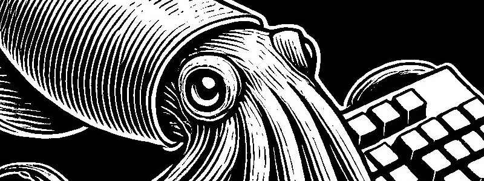

# CCT

Since 2024.10.26

## Language

## Summary

|                  Category                   | Solved | Last |
| :-----------------------------------------: | :----: | :--: |
|           [BFS / DFS](#bfs--dfs)            |        |      |
|      [Implementation](#implementation)      |        |      |
| [Dynamic Programming](#dynamic-programming) |        |      |
|              [Greedy](#greedy)              |        |      |
|         [Brute Force](#brute-force)         |        |      |
|         [Two-Pointer](#two-pointer)         |        |      |
|               [Stack](#Stack)               |        |      |
|            [Sweeping](#sweeping)            |        |      |
|          [Simulation](#simulation)          |        |      |

## Symbols

- solved : Defined as solving a problem by calculating time complexity and space complexity, planning the solution beforehand, and then implementing it.
- ☑️ : Solved within an hour, no need to revisit.
- ✅ : Solved in over an hour, but worth revisiting..
- ❌ : Could not solve within 1 hour. Needed to refer to others' solutions or study more. Should be revisited.

## Practice

### Datastructure 1

|                         Name                          | Level | Stack |    Last    |    Next    |
| :---------------------------------------------------: | :---: | :---: | :--------: | :--------: |
|     [스택](https://www.acmicpc.net/problem/10828)     |  S4   |  ☑️   | 2025-02-07 |            |
|  [단어 뒤집기](https://www.acmicpc.net/problem/9093)  |  B1   |  ☑️   | 2025-02-07 |            |
|     [괄호](https://www.acmicpc.net/problem/9012)      |  S4   |  ☑️   | 2025-02-07 |            |
|    [에디터](https://www.acmicpc.net/problem/1406)     |  S2   | ✅✅  | 2025-03-02 | 2025-03-09 |
|      [큐](https://www.acmicpc.net/problem/10845)      |  S4   |  ☑️   | 2025-02-07 |            |
| [요세푸스 문제](https://www.acmicpc.net/problem/1158) |  S4   |  ☑️   | 2025-02-07 |            |
|      [덱](https://www.acmicpc.net/problem/10866)      |  S4   |  ☑️   | 2025-02-07 |            |

### Datastructure 2

|                         Name                          | Level | Stack |    Last    | Next |
| :---------------------------------------------------: | :---: | :---: | :--------: | :--: |
| [단어 뒤집기2](https://www.acmicpc.net/problem/17413) |  S3   |  ☑️   | 2025-02-17 |      |
|   [쇠막대기](https://www.acmicpc.net/problem/10799)   |  S2   |  ❌   | 2025-02-18 |      |
|    [오큰수](https://www.acmicpc.net/problem/17298)    |  G4   |  ☑️   | 2025-02-18 |      |
|   [오등큰수](https://www.acmicpc.net/problem/17299)   |  G3   |  ☑️   | 2025-02-23 |      |

### Datastructure 3

|                         Name                         | Level | Stack | Last | Next |
| :--------------------------------------------------: | :---: | :---: | :--: | :--: |
| [후위 표기식2](https://www.acmicpc.net/problem/1935) |  S3   |       |      |      |
| [후위 표기식](https://www.acmicpc.net/problem/1918)  |  G2   |       |      |      |
| [접미사 배열](https://www.acmicpc.net/problem/11656) |  S4   |       |      |      |

### Mathematics 1

|                           Name                           | Level | Stack | Last | Next |
| :------------------------------------------------------: | :---: | :---: | :--: | :--: |
| [골드바흐의 추측](https://www.acmicpc.net/problem/6588)  |  S1   |       |      |      |
|   [숨바꼭질 6](https://www.acmicpc.net/problem/17087)    |  S2   |       |      |      |
|      [-2진수](https://www.acmicpc.net/problem/2089)      |  S2   |       |      |      |
| [골드바흐 파티션](https://www.acmicpc.net/problem/17103) |  S2   |       |      |      |

## History

### BFS / DFS

  
Programmers

  
BJ

|                           Name                            | Level | Stack |    Last    |    Next    |
| :-------------------------------------------------------: | :---: | :---: | :--------: | :--------: |
|    [유기농 배추](https://www.acmicpc.net/problem/1012)    |  S2   |  ☑️   | 2025-02-15 |            |
| [연결 요소의 개수](https://www.acmicpc.net/problem/11724) |  S2   |  ☑️   | 2025-02-15 |            |
|     [안전 영역](https://www.acmicpc.net/problem/2468)     |  S1   |  ☑️   | 2025-02-15 |            |
|     [미로 탐색](https://www.acmicpc.net/problem/2178)     |  S1   |  ☑️   | 2025-02-15 |            |
|  [단지번호붙이기](https://www.acmicpc.net/problem/2667)   |  S1   |  ☑️   | 2025-02-15 |            |
|     [숨바꼭질](https://www.acmicpc.net/problem/1697)      |  S1   |  ✅   | 2025-02-15 | 2025-02-18 |
|     [적록색약](https://www.acmicpc.net/problem/10026)     |  G5   |  ☑️   | 2025-02-15 |            |
|      [토마토](https://www.acmicpc.net/problem/7576)       |  G5   |  ☑️   | 2025-02-15 |            |
| [트리의 부모 찾기](https://www.acmicpc.net/problem/11725) |  S2   |  ☑️   | 2025-02-15 |            |
|      [알파벳](https://www.acmicpc.net/problem/1987)       |  G4   |  ☑️   | 2025-02-16 |            |
|   [나이트의 이동](https://www.acmicpc.net/problem/7562)   |  S1   |  ☑️   | 2025-02-16 |            |
|    [영역 구하기](https://www.acmicpc.net/problem/2583)    |  S1   |  ☑️   | 2025-02-16 |            |
|     [섬의 개수](https://www.acmicpc.net/problem/4963)     |  S2   |  ☑️   | 2025-02-17 |            |
|      [A → B](https://www.acmicpc.net/problem/16953)       |  S2   |  ☑️   | 2025-02-17 |            |
|    [이분 그래프](https://www.acmicpc.net/problem/1707)    |  G4   |  ❌   | 2025-02-18 | 2025-02-21 |
|      [연구소](https://www.acmicpc.net/problem/14502)      |  G4   |  ❌   | 2025-02-18 | 2025-02-21 |
|      [토마토](https://www.acmicpc.net/problem/7569)       |  G5   |  ☑️   | 2025-02-19 |            |
|     [촌수계산](https://www.acmicpc.net/problem/2644)      |  S2   |  ✅   | 2025-02-19 | 2025-02-22 |
|       [빙산](https://www.acmicpc.net/problem/2573)        |  G4   |  ☑️   | 2025-02-19 |            |
|    [트리의 지름](https://www.acmicpc.net/problem/1967)    |  G4   |  ❌   | 2025-02-19 | 2025-02-22 |
|     [알고스팟](https://www.acmicpc.net/problem/1261)      |  G4   |  ✅   | 2025-02-22 | 2025-02-25 |
|    [트리의 지름](https://www.acmicpc.net/problem/1167)    |  G2   |  ☑️   | 2025-02-22 |            |
|      [ABCDE](https://www.acmicpc.net/problem/13023)       |  G5   |  ❌   | 2025-02-24 | 2025-02-27 |
|    [인구 이동](https://www.acmicpc.net/problem/16234)     |  G4   |  ❌   | 2025-02-24 | 2025-02-27 |

### Implementation

  
Programmers

  
BJ

### Dynamic Programming

  
Programmers

  
BJ

### Greedy

  
Programmers

  
BJ

### Brute Force

  
Programmers

  
BJ

### Two-Pointer

  
Programmers

  
BJ

### Stack

  
Programmers

  
BJ

### Sweeping

  
Programmers

  
BJ

### Simulation

  
Programmers

  
BJ

### Sliding Window

  
Programmers

  
BJ

### Binary Search

  
Programmers

  
BJ

|                                 Name                                  | Level | Stack |    Last    |    Next    |
| :-------------------------------------------------------------------: | :---: | :---: | :--------: | :--------: |
|          [나무 자르기](https://www.acmicpc.net/problem/2805)          |  S2   |  ☑️   | 2025-02-25 |            |
|          [랜선 자르기](https://www.acmicpc.net/problem/1654)          |  S2   |  ✅   | 2025-02-25 | 2025-02-28 |
|             [게임](https://www.acmicpc.net/problem/1654)              |  S3   |  ✅   | 2025-02-25 | 2025-02-28 |
|             [예산](https://www.acmicpc.net/problem/2512)              |  S2   |  ☑️   | 2025-02-26 |            |
|          [공유기 설치](https://www.acmicpc.net/problem/2110)          |  G4   |  ✅   | 2025-02-26 | 2025-03-01 |
|             [용액](https://www.acmicpc.net/problem/2467)              |  G5   |  ❌   | 2025-02-27 | 2025-03-02 |
|           [중량제한](https://www.acmicpc.net/problem/1939)            |  G3   |  ✅   | 2025-02-28 | 2025-03-03 |
|             [좋다](https://www.acmicpc.net/problem/1253)              |  G4   |  ❌   | 2025-02-28 | 2025-03-03 |
|            [세 용액](https://www.acmicpc.net/problem/2473)            |  G3   |  ✅   | 2025-03-01 | 2025-03-04 |
|           [K번째 수](https://www.acmicpc.net/problem/1300)            |  G1   |  ❌   | 2025-03-01 | 2025-03-04 |
| [가장 긴 증가하는 부분 수열 3](https://www.acmicpc.net/problem/12738) |  G2   |  ❌   | 2025-03-02 | 2025-03-05 |

