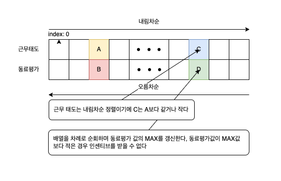

# 인사 고과

[인사 고과](https://school.programmers.co.kr/learn/courses/30/lessons/152995)

## Review

| Date  | Solved |
| :---: | :----: |
| First |   ❌   |

## Overview

- Language : JAVA
- Platform : [Programmers](https://school.programmers.co.kr/learn/courses)
- Difficulty : Lv.3
- Algorithm : Sweeping
- Taken : 3h
- Rate : 41%

## Solution

첫 풀이

- 모든 경우의 수를 검색

- 시간이 오래걸리는 부분이 있으나 어찌어찌 통과

```JAVA
import java.util.*;

class Solution {
    public int solution(int[][] scores) {
        int answer = 0;
        Queue<int[]> q = new LinkedList<>();
        PriorityQueue<int[]> pq = new PriorityQueue<>((a,b)->{
            if(a[0] != b[0]) {
                return a[0] - b[0];
            } else {
                return a[1] - b[1];
            }
        });
        int[] wh = scores[0];
        int whSum = wh[0] + wh[1];
        boolean start = false;
        for(int[] score : scores) {
            if(!start) {
                start = true;
                continue;
            }
            int sum = score[0] + score[1];
            if(wh[0] < score[0] && wh[1] < score[1]) {
                answer = -1;
                break;
            } else {
                if(sum > whSum) {
                    boolean flag = false;
                    for(int i = 0; i < q.size(); i++) {
                        int[] item = q.peek();
                        if(item[0] < score[0] && item[1] < score[1]) {
                            q.poll();
                        } else {
                            int[] t = q.poll();
                            q.add(t);
                        }
                        if(score[0] < item[0] && score[1] < item[1]) {
                            flag = true;
                        }
                    }
                    if(!flag) {
                       q.add(score);
                    }
                }
            }
        }
        return answer < 0 ? answer : q.size() + 1;
    }
}
```

두번째 풀이

```java
import java.util.*;

class Solution {
    public int solution(int[][] scores) {
        int answer = 0;
        Queue<int[]> q = new LinkedList<>();
        PriorityQueue<int[]> pq = new PriorityQueue<>((a,b)->{
            if(a[0] != b[0]) {
                return b[0] - a[0];
            } else {
                return a[1] - b[1];
            }
        });
        PriorityQueue<int[]> pq2 = new PriorityQueue<>((a,b)->{
            int sumA = a[0] + a[1];
            int sumB = b[0] + b[1];
            return sumA - sumB;
        });
        int[] wh = scores[0];
        int whSum = wh[0] + wh[1];
        boolean start = false;
        for(int[] score : scores) {
            if(wh[0] < score[0] && wh[1] < score[1]) {
                return -1;
            }
            pq.add(score);
        }
        int max = 0;
        while(pq.size() > 0) {
            int[] item = pq.poll();
            if(item[1] >= max) {
                max = item[1];
                pq2.add(item);
            }
        }
        while(pq2.size() > 0) {
            int[] item = pq2.peek();
            int sum = item[0] + item[1];
            if(sum <= whSum) {
                pq2.poll();
            } else {
                break;
            }
        }
        return pq2.size() + 1;
    }
}
```

- Sweeping 알고리즘 사용



- 왜 동료 평가 점수를 오름차순으로 정렬해야 하는가?

  - 사원이 인센티브를 받으려면 **다른 모든 사원에 대해 근무 태도 점수 또는 동료 평가 점수에서 뒤처지지 않아야** 한다

- 왜 근무 태도 점수는 내림차순으로 정렬해야 하는가?

  - 근무 태도 점수가 높은 순서로 정렬했기 때문에, 이후 사원은 앞선 사원들보다 **근무 태도 점수에서 무조건 낮거나 같음**
  - 따라서, 현재 사원과 앞선 사원들을 비교할 때 **근무 태도 점수는 이미 조건을 만족**한 상태로 간주할 수 있다

- 동료 평가 점수를 오름차순으로 정렬

  - 근무 태도 점수가 동일할 때, 동료 평가 점수가 작은 사원이 먼저 나오도록 한다
  - 이렇게 정렬하면 **근무 태도 점수는 같거나 크고, 동료 평가 점수는 앞선 사원보다 작거나 같은 구조**가 만들어진다

---

- 왜 동료 평가 점수의 최대값을 기록하는가?

  - 정렬된 상태에서, 각 사원을 탐색하며 **현재까지의 최대 동료 평가 점수**를 기록한다 이 값은 **이전 사원들 중 가장 높은 동료 평가 점수**를 의미한다

  - 현재 사원의 동료 평가 점수가 **최대 동료 평가 점수보다 작다면**, 해당 사원은 이미 앞선 사원에게 두 점수 모두 뒤처진 상태

  - 따라서 **인센티브를 받을 자격이 없는 사원**으로 판정할 수 있다

---

### 예시: 정렬되지 않은 경우의 문제

입력 데이터

\[
[ [4, 5], [4, 3], [3, 6], [3, 2], [2, 4] ]
\]

정렬하지 않은 경우

근무 태도 점수만 내림차순으로 정렬하고, 동료 평가 점수는 정렬하지 않음

결과:

\[ [4, 5], [4, 3], [3, 6], [3, 2], [2, 4] \]

탐색을 시작하며 최대 동료 평가 점수를 기록합니다:

1. 첫 번째 사원: \([4, 5]\) → 동료 평가 최대값 \(= 5\) (갱신)
2. 두 번째 사원: \([4, 3]\) → \(3 < 5\) → **탈락**
3. 세 번째 사원: \([3, 6]\) → \(6 > 5\) → 동료 평가 최대값 \(= 6\) (갱신)
4. 네 번째 사원: \([3, 2]\) → \(2 < 6\) → **탈락**
5. 다섯 번째 사원: \([2, 4]\) → \(4 < 6\) → **탈락**

결과:

유효한 사원: \([4, 5], [3, 6]\)

---

문제 발생

정렬되지 않은 경우, 두 번째 사원 \([4, 3]\)은 근무 태도 점수가 동일하지만, 동료 평가 점수가 오름차순으로 정렬되지 않아 잘못 탈락한다 이 사원은 앞선 사원보다 동료 평가 점수에서 열등하다고 잘못 판정된 것

---

**오름차순 정렬이 필요한 이유**

1. **동료 평가 점수를 오름차순으로 정렬하면, 탐색 순서대로 조건을 검증할 수 있음**:

   - 동료 평가 점수가 오름차순으로 정렬되어 있다면, 현재 사원의 동료 평가 점수가 더 작더라도 근무 태도 점수에서 우위이기 때문에 올바르게 판단할 수 있음

2. **정렬된 상태에서 최대 동료 평가 점수를 기록하는 방식이 작동**:
   - 동료 평가 점수가 오름차순으로 정렬되었기 때문에, 현재 사원이 이전 최대값보다 작다면 앞선 사원에게 반드시 뒤처진다
   - 즉, 오름차순 정렬을 통해 이전 사원들의 우위를 보장할 수 있다

---

### 예시: 동료 평가 점수를 오름차순 정렬한 경우

입력 데이터:

\[
[ [4, 5], [4, 3], [3, 6], [3, 2], [2, 4] ]
\]

정렬 (근무 태도 내림차순, 동료 평가 오름차순):

결과:

\[ [4, 3], [4, 5], [3, 2], [3, 6], [2, 4] \]

탐색하며 최대 동료 평가 점수를 기록:

1. 첫 번째 사원: \([4, 3]\) → 동료 평가 최대값 \(= 3\) (갱신)
2. 두 번째 사원: \([4, 5]\) → \(5 > 3\) → 동료 평가 최대값 \(= 5\) (갱신)
3. 세 번째 사원: \([3, 2]\) → \(2 < 5\) → **탈락**
4. 네 번째 사원: \([3, 6]\) → \(6 > 5\) → 동료 평가 최대값 \(= 6\) (갱신)
5. 다섯 번째 사원: \([2, 4]\) → \(4 < 6\) → **탈락**

결과:

유효한 사원: \([4, 3], [4, 5], [3, 6]\)

---

- **동료 평가 점수를 오름차순으로 정렬하지 않으면**, 현재 사원이 앞선 사원들에게 지배되는지 제대로 판단할 수 없다
- 오름차순 정렬은 탐색 중에 "현재 사원의 동료 평가 점수가 최대 동료 평가 점수보다 작은 경우, 해당 사원이 조건을 만족하지 못함"을 보장하기 위해 필수적
- 이를 통해 효율적으로 조건을 검증하며, \(O(N \log N)\) 시간 복잡도를 유지할 수 있다
