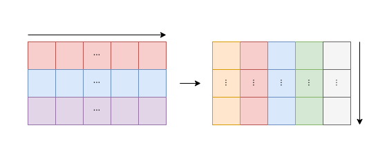
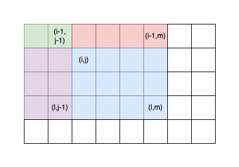

# 가장 큰 정사각형 찾기

[가장 큰 정사각형 찾기](https://school.programmers.co.kr/learn/courses/30/lessons/12905)

## Review

| Date  | Solved |
| :---: | :----: |
| First |   ❌   |

## Overview

- Language : JAVA
- Platform : [Programmers](https://school.programmers.co.kr/learn/courses)
- Difficulty : Lv.2
- Algorithm : DP
- Taken : 1d
- Rate : 46%

## Solution

- DP를 쓴다는 발상조차 하지 못했고
- 풀이를 봐도 한번에 이해하지 못했다
- DP문제는 문제에 대해 점화식을 세울 수 있어야 풀린다고 한다

- 1차 풀이

  - 누적합을 사용하여 사각형의 넓이를 구했지만, 시간 초과

- 2차 풀이
  - DP 문제임을 확인

### 누적합



1. 각 행의 누적합을 왼쪽에서 오른쪽 방향으로 구한다
2. 각 열의 누적합을 위에서 아래 방향으로 구한다

#### 예시

|  0  |  1  |  1  |  1  |  0  |
| :-: | :-: | :-: | :-: | :-: |
|  1  |  1  |  0  |  1  |  0  |
|  0  |  0  |  1  |  0  |  1  |
|  0  |  1  |  1  |  1  |  0  |
|  1  |  0  |  0  |  1  |  1  |

각 행의 누적합

|  0  |  1  |  2  |  3  |  3  |
| :-: | :-: | :-: | :-: | :-: |
|  1  |  2  |  2  |  3  |  3  |
|  0  |  0  |  1  |  1  |  2  |
|  0  |  1  |  2  |  3  |  3  |
|  1  |  1  |  1  |  2  |  3  |

각 열의 누적합을 계산한 최종 누적합

|  0  |  1  |  2  |  3  |  3  |
| :-: | :-: | :-: | :-: | :-: |
|  1  |  3  |  4  |  6  |  6  |
|  1  |  3  |  5  |  7  |  8  |
|  1  |  4  |  7  | 10  | 11  |
|  2  |  5  |  8  | 12  | 14  |

### 누적합을 사용한 사각형 넓이



사각형 범위의 좌측 상단 꼭짓점이 \((i, j)\), 우측 하단 꼭짓점이 \((l, m)\)일 때 넓이 A는

$$A = S[l][m] - S[i-1][m] - S[l][j-1] + S[i-1][j-1]$$

- `S[l][m]`: 전체 범위의 누적합
- `S[i-1][m]`: 사각형 위쪽의 누적합 제거
- `S[l][j-1]`: 사각형 왼쪽의 누적합 제거
- `S[i-1][j-1]`: 중복으로 제거된 값을 다시 더함

#### 예시

|  0  |  1  |  1  |  1  |  0  |
| :-: | :-: | :-: | :-: | :-: |
|  1  |  1  |  0  |  1  |  0  |
|  0  |  0  |  1  |  0  |  1  |
|  0  |  1  |  1  |  1  |  0  |
|  1  |  0  |  0  |  1  |  1  |

위 테이블에서 T[1][1], T[2][3] 으로 이루어진 사각형 내부의 총 합 S

|  0  |  1  |  2  |  3  |  3  |
| :-: | :-: | :-: | :-: | :-: |
|  1  |  3  |  4  |  6  |  6  |
|  1  |  3  |  5  |  7  |  8  |
|  1  |  4  |  7  | 10  | 11  |
|  2  |  5  |  8  | 12  | 14  |

$S = 7(T[2][3]) - 3(T[0][3]) - 1(T[2][0]) + 0(T[0][0]) = 3$

```java
import java.util.*;

class Solution {
    public int solution(int[][] board) {
        int answer = 0;
        int rows = board.length;
        int cols = board[0].length;

        int[][] dp = new int[rows][cols];

        for (int i = 0; i < rows; i++) {
            for (int j = 0; j < cols; j++) {
                if (board[i][j] == 1) {
                    if (i == 0 || j == 0) {
                        dp[i][j] = 1;
                    } else {
                        dp[i][j] = Math.min(Math.min(dp[i - 1][j], dp[i][j - 1]), dp[i - 1][j - 1]) + 1;
                    }
                    answer = Math.max(answer, dp[i][j]);
                }
            }
        }

        return answer * answer;
    }
}
```

$$
$$
